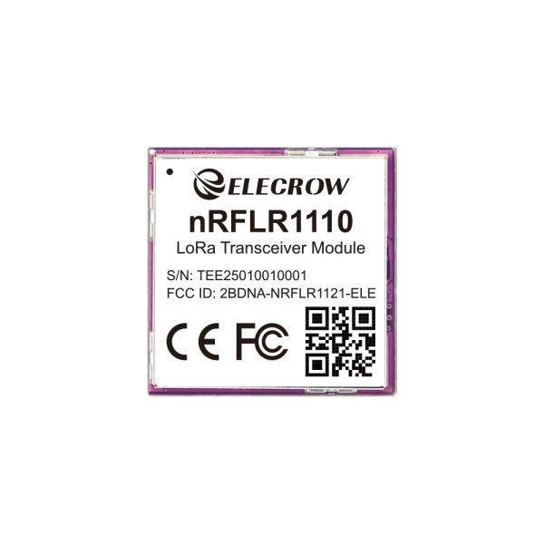
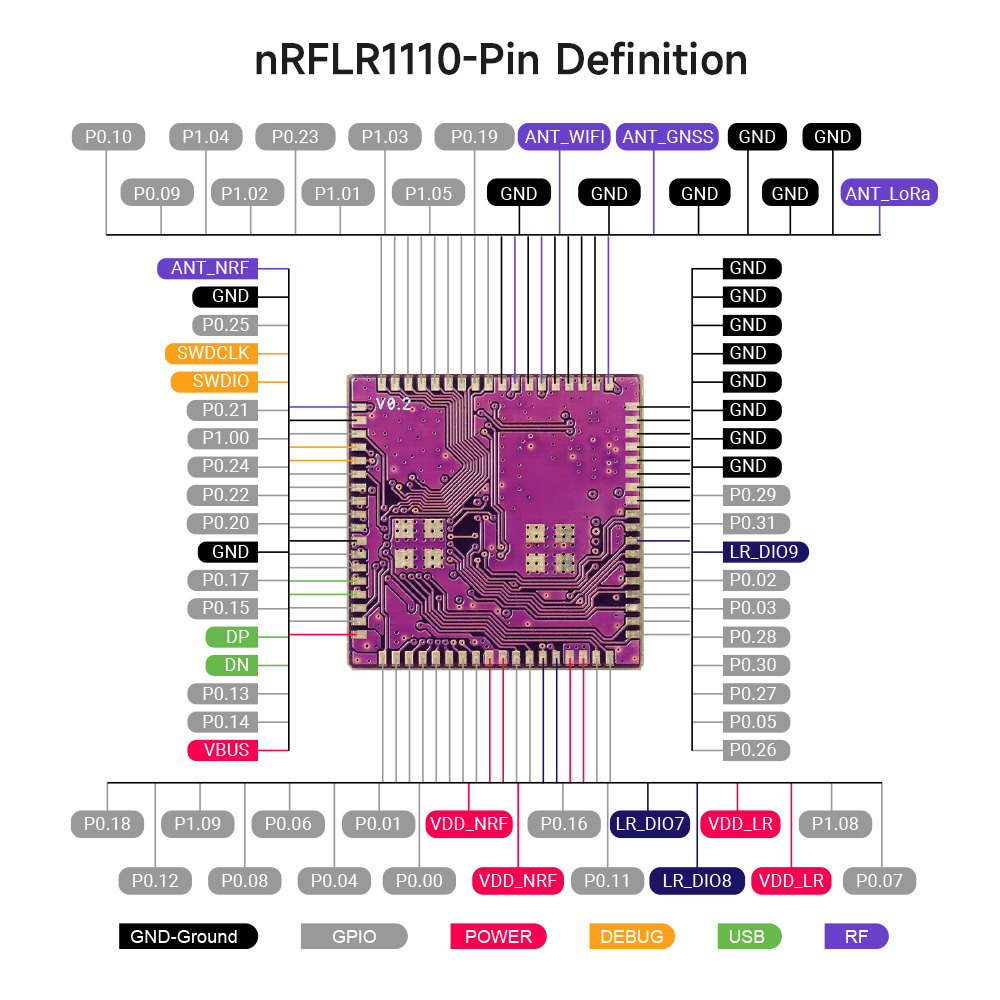
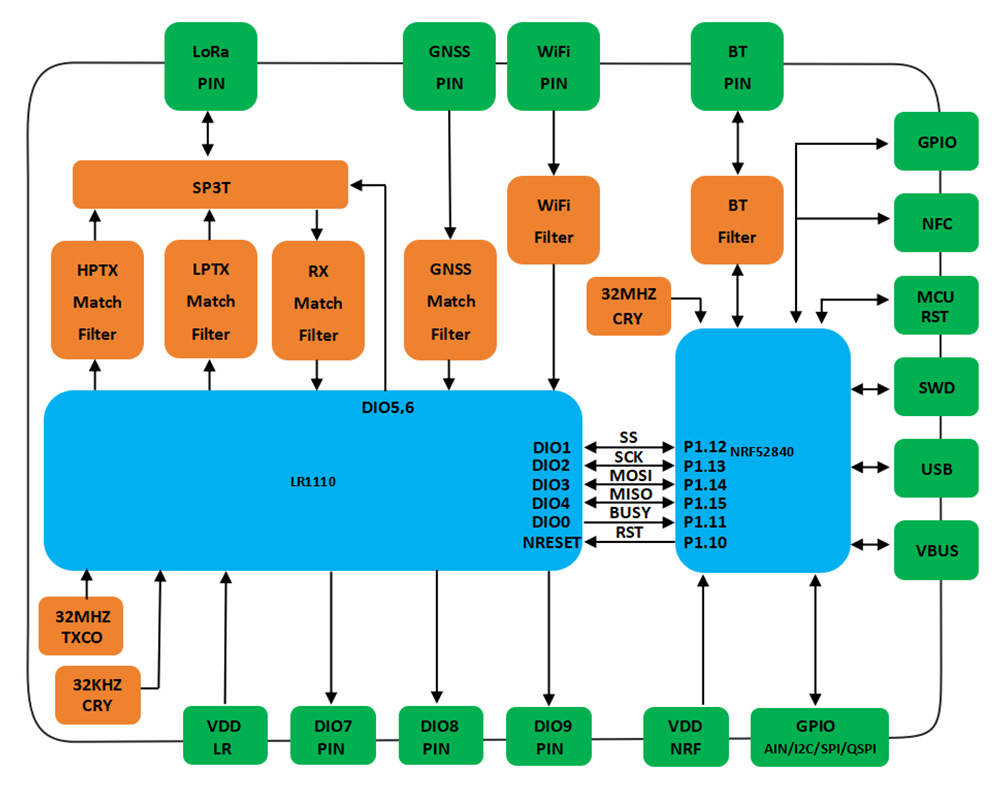

### 1, Product picture

link:

https://www.elecrow.com/elecrow-nrflr1110-wireless-transceiver-module-integrates-nordic-nrf52840-and-semtech-lr1110.html

### 2, Product version number

|      | Hardware | Software | Remark |
| ---- | -------- | -------- | ------ |
| 1    | V1.0     | V1.0     | latest |

### 3, product information

| Processor                   | nRF52840 processor, dual-core 32-bit, 64MHz main frequency   |
| --------------------------- | ------------------------------------------------------------ |
| RF chip                     | Semtech LR1110 Chip                                          |
| LoRa Specification          |                                                              |
| Transmit Power TX           | +22 dBm@Max                                                  |
| Receiving Sensitivity       | -141dBm                                                      |
| Link Budget                 | Support 166db link budget                                    |
| Demodulator                 | Support LoRa/(G)FSK/GMSK/Sigfox signal modulation            |
| LoRa Frequency Range        | Support 150MHz-960MHz configuration                          |
| Spreading Factor            | SF5~SF12                                                     |
| Data Transfer Rate          | Supports data transmission rates from 1.76 to 62.5 Kbps      |
| Other                       |                                                              |
| Frequency                   | Covering 850~930MHz (applicable to 868MHz, 915MHz)           |
| Communication Interface     | SPI(0~10Mbps)                                                |
| Lead Pin                    | Such as SPI signal, VCC, multiple GND, NRST, ANT, TX control, RX control, BUSY status, NFC, SWD debugging pin, etc. |
| Antenna                     | Not onboard, via RF pins                                     |
| Reference Power Consumption | 6uA (sleep), 126mA (transmit + MCU), 18mA (receive + MCU)8mA @Bluetooth Scan、8mA @WiFi Scan |
| Communication Distance      | 5~6km, up to 10km                                            |
| Crystal Type                | Industrial grade 32MHz TCXO                                  |
| LoRaWAN Protocol            | Class A/B/C (compliant with LoRaWAN 1.0.4 specification)     |
| Operating Voltage           | 1.8~3.7V                                                     |
| Operating Temperature       | -40℃~+85℃, Industrial standard design                        |
| Package Size                | 20*20*3.5mm, 80-Pin, SMT patch, LGA package;                 |
| Weight                      | 3g                                                           |

### 4,Folder structure.

|--Datasheet: Includes datasheets for components used in the project, providing detailed specifications, electrical characteristics, and pin configurations.

|--example: Provides example code and projects to demonstrate how to use the hardware and libraries. These examples help users get started quickly.

|--factory_firmware: Stores pre-compiled factory firmware that can be directly flashed onto the device. This ensures the device runs the default functionality.

### 5,Pin definition

**IO port definition**

##### Diagram:

